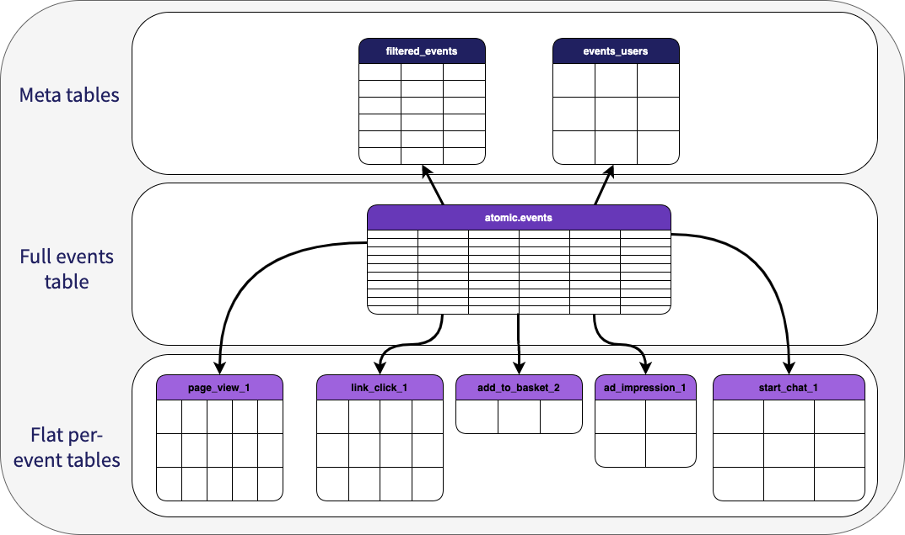

# Snowplow Event Splitting Package

**The package source code can be found in the [snowplow/dbt-snowplow-event-splitting repo](https://github.com/snowplow/dbt-snowplow-event-splitting), and the docs for the [macro design here](https://snowplow.github.io/dbt-snowplow-event-splitting/#/overview/snowplow_event_splitting).** 

The package provides 2 macros and a python script that is used to generate your models; these [macros](https://docs.getdbt.com/docs/build/jinja-macros) provide a table per event type that you specify, and can also produce a thin table of the split events and a user table, for use within downstream ETL tools such as Hightouch. 

The package does not have any models itself, but generates models in your project as if they were custom models built on top of the [Snowplow web package](/docs/modeling-your-data/modeling-your-data-with-dbt/dbt-web-data-model/index.md), using the `_this_run` table as the base for new events to process each run. Because of this it will be impacted by the filters used within that package, as any custom models you created would be.




## Overview

This package consists of two macros, a python script, and some example configuration files to help you get started:

  - `split_events` _(macro)_: This macro does the heavy lifting of the package, taking a series of inputs to generate the SQL required to split the events table and flatten (1 level) of any [self-describing event](/docs/understanding-tracking-design/out-of-the-box-vs-custom-events-and-entities/index.md#self-describing-events) or [context](/docs/understanding-tracking-design/predefined-vs-custom-entities/index.md#custom-contexts) columns. While you can use this macro manually it is recommended to create the models that use it by using the script provided.

  - `users_table` _(macro)_: This macro takes a series of inputs to generate the SQL that will produce your users table (1 row per user, with the latest version of the contexts you specify as the other columns), using the `user_id` column and any custom contexts from your events table.

  - `snowplow_split_events_model_gen.py` _(script)_: This script uses an input configuration to generate your per-event models based on the schemas used to generate those events in the first place. See the [operation](#operation) section for more information.

    ```yml title="snowplow_split_events_model_gen.py help"
    usage: snowplow_split_events_model_gen.py [-h] [--version] [-v] [--dryRun] [--configHelp] config

    Produce dbt model files for splitting your Snowplow events table into 1 table per event.

    positional arguments:
    config         relative path to your configuration file

    optional arguments:
    -h, --help     show this help message and exit
    --version      show program's version number and exit.
    -v, --verbose  verbose flag for the running of the tool
    --dryRun       flag for a dry run (does not write to files).
    --configHelp   prints information relating to the structure of the config file.
    ```

  - `example_event_split_config.json`: This file is an example of an input to the python script, showing all options and valid values. For additional information about the file structure run `python utils/snowplow_split_events_model_gen.py --configHelp` in your project root.

  - `example_resolver_config.json`: This file is an example [Iglu Resolver](/docs/pipeline-components-and-applications/iglu/iglu-resolver/index.md) configuration. It supports custom iglu servers with API keys, but does not currently support accessing embedded registries. For more information please see the Resolver docs.


## Operation

In general, it should only be required to run the script in this package once to begin with, then only as/when you need to add new models based on new events or alter the contexts attached to existing ones. While it is possible to manually set the values and use the macros, it is not recommended due to the time it would take and the likelihood of making mistakes.

:::caution
The script should always be run from the **root** of your dbt project (the same level your `dbt_project.yml` file is at).
:::

### Install python packages
:::caution
At least Python 3.7 is required to run the script

:::

The script only requires 2 additional packages (`jsonschema` and `requests`) that are not built into python by default, you can install these by running the below command.

```bash
pip install requirements.txt
```

### Configuration File
The configuration file is used to provide the information needed to generate the SQL models for your split event tables. We use the [schemas](/docs/understanding-tracking-design/understanding-schemas-and-validation/index.md) that are defined in your event tracking to ensure full alignment with the data and reduce the amount of information you need to provide.

:::info
The config file is a JSON file which can be viewed by running the python script with the `--configHelp` flag. The config file can be located anywhere in your project, but it must have the following structure. Note that you must provide **at least** one of `event_columns`, `self_describing_event_schema` or `context_schemas` for each event listed.

:::

- `config` _(required - object)_:
  - `resolver_file_path` _(required - string)_: Relative path to your resolver config json, or `"default"` to use iglucentral only
  - `filtered_events_table_name` _(optional - string)_: Name of total events table, if not provided it will not be generated
  - `users_table_name` _(optional - string)_: Name of users table, default `events_users` if user schema(s) provided
  - `validate_schemas` _(optional - boolean)_: If you want to validate schemas loaded from each iglu registry or not, default `true`
  - `overwrite` _(optional - boolean)_: Overwrite existing model files or not, default `true`
  - `models_folder` _(optional - string)_: Folder under `models/` to place the models, default `snowplow_split_events`
- `events` _(required - array)_:
  - `event_1` _(required - object)_:
    - `event_name` _(required - string)_: Name of the event type, value of the event_name column in your warehouse
    - `event_columns` _(optional (>=1 of) - array)_: Array of strings of flat column names from the events table to include to include in the model
    - `self_describing_event_schema` _(optional (>=1 of) - string)_: `iglu:com.` type url for the self-describing event to include in the model
    - `context_schemas` _(optional (>=1 of) - array)_: Array of strings of `iglu:com.` type url(s) for the context/entities to include in the model
    - `context_aliases` _(optional - array)_: Array of strings of prefix to the column alias for context/entities
    - `table_name` _(optional - string)_: Name of the model, default is the event_name and major version number
  - `event_2` _(option - object)_
  - ...
  - `event_n` _(option - object)_
- `users` _(option - array)_: Array of strings of schemas for your user contexts to add to your users table as columns, if not provided will not generate users model

An example configuration can be found in the `utils/example_event_split_config.json` file.

### Producing your models
To produce your models you need to run `python utils/snowplow_split_events_model_gen.py path/to/your/config` from the root of your dbt project. This will produce one `.sql` file for each of the event names specified in the `events` part of your configuration, one `.sql` file for the combined filtered events table if a name was provided, and one `.sql` file for your users table if schema(s) were provided. These files will be in your `models` folder in the sub-folder specified in your config. 

:::info
Custom error messages have been added to the script to try and catch any issues and provide suggested resolutions to any issues such as invalid configurations or failing validation of schemas. If you persist in getting errors when validating schemas you believe you be correct, you can disable this validation by setting `validate_schemas` to `false` in your config. 
:::

### Adding new models
To add new models for new types of events, simply add them to your config and run the model again. Note that `overwrite` must be set to `true` for your filtered events table model to include these new events, and that this will overwrite any manual changes you made to the other models generated by this script.

### Updating your models
If you wish to update your models, such as adding a new context or removing a column, you must update your config file and run the script again, ensuring the `overwrite` value is set to `true`. Note that this will remove any custom changes you made to the model file itself and you will need to re-add these.

All events will be updated including the filtered events table, it is not possible at this time to update just a subset of models.

:::warning
Adding or removing columns from your dbt model without specifying the `on_schema_change` model configuration, or directly altering the tables in your database, is very likely to result in unintended outcomes - either your new columns will not appear or dbt may return an error. Please see the [dbt docs](https://docs.getdbt.com/docs/build/incremental-models#what-if-the-columns-of-my-incremental-model-change) for what to do in this situation. If you need to backfill new columns regardless you can perform a rerun of the entire model following the instructions [here](/docs/modeling-your-data/modeling-your-data-with-dbt/dbt-custom-models/index.md#tearing-down-and-restarting-a-subset-of-models) *(note using the `--full-refresh` flag will not work in this case due to the use of the Snowplow incremental logic)*.
:::

### Removing models
Currently there is no method for removing models no longer listed in your config, if you wish to remove any models you can either [disable them in your project](https://docs.getdbt.com/reference/resource-configs/enabled) if you plan to turn them back on later, or simply remove the `.sql` files for the models themselves.